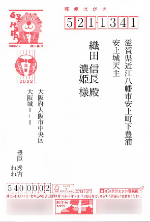

# What is this

This is a LuaLaTeX style file for creating Japanese New Year greeting postcards - Nengajo.

これは年賀状の宛名面の生成のためのLuaLaTeXのスタイルファイルです.

# How to use

Have Hiragino Mincho Pro font on your computer (or you can try other fonts).
Save the following as `nenga.tex`:

```latex
\documentclass{jlpostcard}

\usepackage[hiragino-pro]{luatexja-preset}

% Sender's information
\sendername{豊臣&秀吉\\&ねね}
\senderaddressa{大阪府大阪市中央区}
\senderaddressb{大阪城１−１} % hyphens should be full-width for correct vertical text layout
\senderpostcode{5400002}

\begin{document}

\addaddress
  {織田&信長&殿\\&濃姫&様} % skipping family name for wife
  {5211341}
  {滋賀県近江八幡市安土町下豊浦}    
  {安土城天主}

\end{document}
```

Execute in shell:

```bash
latexmk -lualatex -auxdir=Output nenga.tex
```

Expected output of nenga.pdf:



By default, the style includes the background of the postcard address side for debugging.
For printing, pass the release flag to the class declaration:

```latex
\documentclass[release]{jlpostcard}
```

# Differences from https://github.com/ueokande/jletteraddress

* Uses LuaLaTeX because I don't like pLaTeX
* Can be used with arbitrary ttf/otf fonts (see `texdoc luatexja`, section 3.3 for presets)
* Should be more easily editable/customizable
* Support families instead of single sender or reciever (using table syntax, thanks once more for `luatex-ja`)
